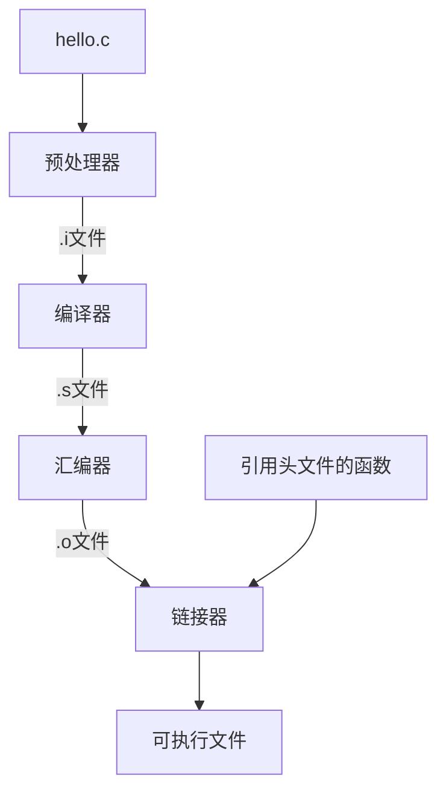

计算机系统 = 硬件 + 软件

- - -

## 可执行文件文件的生成



- ### 预处理阶段
**预处理阶段会将 #define, #include 等 '#' 开头的代码扩展到代码里面. 而 #define 定义的名将会简单的替换掉代码里调用的名(称为宏替换).**

- ### 编译阶段
**这个时候, 编译器会进行语法上的检测, 报错**

- ### 汇编阶段
**将代码转成相应的汇编代码, 最后再由其他的操作转化成机器指令. 汇编器也会对代码做一些相应的优化工作, 使其更加的贴近机器的处理**

- ### 链接器
  **将会找到每个函数匹配的可执行函数的位置**
  **代码扩展成的.o文件与所调用的系统函数(如: printf, scanf等)的.o文件进行链接, 映射, 使代码能直接调用系统函数了.**
  对于多次定义的变量但是没有初始化的变量程序链接的时候会将其当作是临时变量.

  ---

- ### 关于数据代码的存放

  **库函数是存放在虚拟地址空间中的用户虚拟内存的共享库内存区域里面, 而代码是存放在只读的 '.text'中, 初始化变量, 全局变量存在 '.data'中, 为初始化的变量则存放在 '.bss'里.**

  ---

### 预处理的扩充 -- 粘贴运算符

> 标记粘贴运算符（##）
> 宏定义内的标记粘贴运算符（##）会合并两个参数。它允许在宏定义中两个独立的标记被合并为一个标记

```c
#include <stdio.h>

#define Printf(n) printf("Printf" #n " = %d\n", Printf##n)

int main()
{
    int Printf0 = 0, Printf1 = 1, Printf2 = 2;
    Printf(0);
    Printf(1);
    Printf(2);

    return 0;
}
```
输出
```c
rpz@funct:Code$ ./a.out
Printf0 = 0
Printf1 = 1
Printf2 = 2
```

### define 与 typedef 的区别

> **从生存时间 : 引用了宏就会到程序借宿才会结束. 除非使用 #undef 取消宏定义. 而typedef自有在自己有效的作用域才有效.**
> **从处理时间 : 宏不占用程序运行时间, 它只占用编译阶段的时间. 这点跟 typedef 有区别(typedef 占用程序运行时间 )**
> **从报错时间 : define在预处理阶段处理完成, 但是并不会进行错误分析. 而typedef要在编译阶段才会发现错误.**
> **typedef 是定义一个新的数据类型, 而不是简单的宏替换**
- - -


