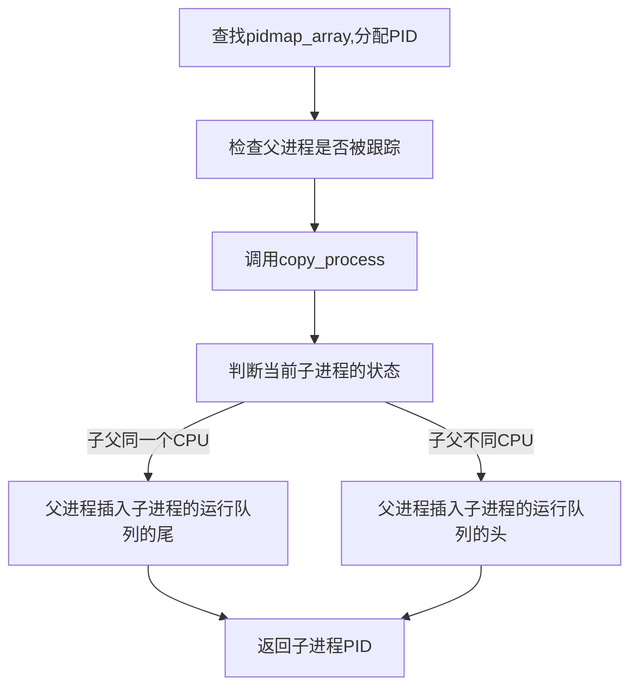
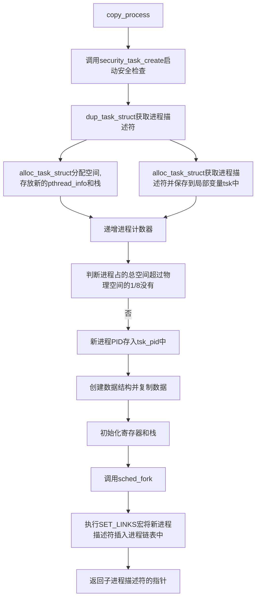

```mermaid
graph TD
查找pidmap_array,分配PID --> 检查父进程是否被跟踪
检查父进程是否被跟踪 --> 调用copy_process
调用copy_process --> 判断当前子进程的状态
判断当前子进程的状态 -- 子父同一个CPU --> 父进程插入子进程的运行队列的尾
判断当前子进程的状态 -- 子父不同CPU --> 父进程插入子进程的运行队列的头
父进程插入子进程的运行队列的尾 --> 返回子进程PID
父进程插入子进程的运行队列的头 --> 返回子进程PID
```

**copy_process调用执行的功能**

```mermaid
graph TD

copy_process --> 调用security_task_create启动安全检查
调用security_task_create启动安全检查 --> dup_task_struct获取进程描述符
dup_task_struct获取进程描述符 --> alloc_task_struct获取进程描述符并保存到局部变量tsk中
dup_task_struct获取进程描述符 --> alloc_task_struct分配空间,存放新的pthread_info和栈
alloc_task_struct分配空间,存放新的pthread_info和栈 --> 递增进程计数器
alloc_task_struct获取进程描述符并保存到局部变量tsk中 --> 递增进程计数器
递增进程计数器 --> 判断进程占的总空间超过物理空间的1/8没有
判断进程占的总空间超过物理空间的1/8没有 -- 否 --> 新进程PID存入tsk_pid中
新进程PID存入tsk_pid中 --> 创建数据结构并复制数据
创建数据结构并复制数据 --> 初始化寄存器和栈
初始化寄存器和栈 --> 调用sched_fork
调用sched_fork --> 执行SET_LINKS宏将新进程描述符插入进程链表中
执行SET_LINKS宏将新进程描述符插入进程链表中 --> 返回子进程描述符的指针
```

