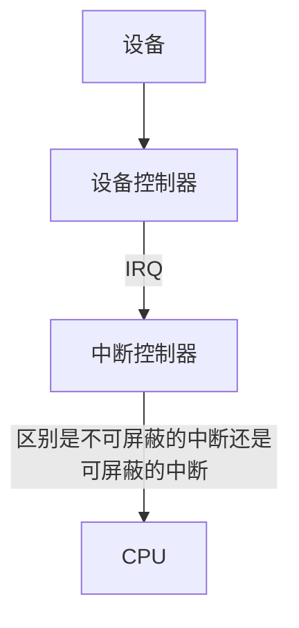
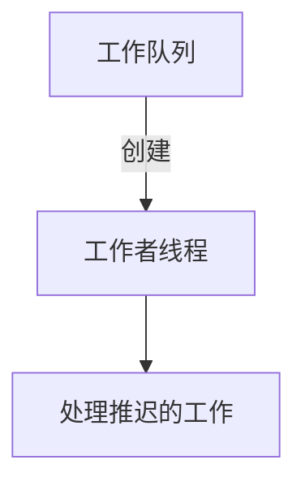

# 中断

[TOC]

---

<font color=#b20>**中断内部被细分成了两部分, 中断上半部, 中断下半部.**</font>

中断不能被相同类型的中断打断，而下半部依然可以被中断打断；中断对于时间非常敏感，而下半部基本上都是一些可以延迟的工作。由于二者的这种区别，所以对于一个工作是放在上半部还是放在下半部去执行，可以参考下面4条：

1. 如果一个任务对时间非常敏感，将其放在中断处理程序中执行。
2. 如果一个任务和硬件相关，将其放在中断处理程序中执行。
3. 如果一个任务要保证不被其他中断（特别是相同的中断）打断，将其放在中断处理程序中执行。
4. 其他所有任务，考虑放在下半部去执行。 

---

## 中断上半部



**中断上下文**

进程上下文是运行在内核态帮助进程在内核执行, 通过current宏关联当前的进程, 在内核态进程是可以睡眠的, 可以调用调度函数的, 但是中断上下文是不能睡眠的.

> 1. 中断上半部主要就是快速的处理中断信号.
> 2. 它有严格的时间限制, 因为中断会打断其他代码的执行.
> 3. 中断上半部处理的时侯不会被打断, 不能睡眠, 所以不能在中断执行某些函数(并不是不能执行其他函数).
> 4. 尽量将中断工作(处理等)交给中断下半部.


<font color=#b20>**中断处理程序是被内核用来处理中断的, 同时他也是不可阻塞的, 检测到中断就会立即执行.**</font>

**中断上半部运行的就是中断处理函数, 它主要是将中断交给下半部来处理, 同时在中断处理结束返回时标记它是什么类型的中断.**比如 软中断代替用户态进程在内核态运行返回时, 中断调用`run_local_times`将其标记为软中断.

<font color=#b20>**中断也有自己的中断栈, 大概1kb左右.</font> 为了保存执行在中断的一些函数的数据, 指针.**

---

## 中断下半部

因为中断上半部要达到即时响应, 将工作都交给了中断下半部.

> *下半部的实现是由以下构成的*
>
> 1. k);
>
> 	  // 重复执行
>
> 2. 软中断
>
> 3. tasklets
>
> 3. 工作队列

### 软中断

<font color=#b20>**软中断是由编译时静态分配的**. 产生后并不是马上可以执行，必须要等待内核的调度才能执行。可以并发运行在多个CPU上.</font>

同样, 在函数调用的时侯, 经系统调用触发软中断, 陷入内核, 此时内核"代替进程"在内核空间运行.

 当运行一个软中断处理程序的时侯, 他会执行 <font color=#b20>action</font>函数执行中断调用, 其唯一的参数指向 <font color=#b20>softirq_action</font>结构体, 软中断是在 do_softirq中运行.

*软中断描述符*

```c
struct softirq_action
{ 
    void (*action)(struct softirq_action *);
};
```

*软中断执行函数*

```c
do_softirq-->__do_softirq
```


*软中断在 do_softirq() 的执行*

```c
u32 pending;
// 获取软中断
pending = local_softirq_pending();

// 如果有软中断, pending就不为0
if(pending)
{
    struct softirq_action *h;

    // 清除当前的软中断, 当前中断已经保存在pending中了
    set_softirq_pending(0);

    // h 指向当前softirq_vec 的第一项, 也就是第一个向量号
    h = softirq_vec;
    do{
        // 向量号为 1, 代表次信号开启, 需要被执行
        if(pending & 1)
            // action 执行当前向量号的中断
            h->action(h);
        
        /* 下面就是移动至下一个向量号, 直到 pending 没有要处理的中断信号了 */
        h++;
        pending >>= 1;
    }while(pending);
}
```


> 1. 软中断是不会抢占其他软中断. 而唯一能够抢占中断的函数就是中断处理函数.
> 2. 软中断的调用一般是由系统调用引起的,  用户态进程触发软中断而陷入内核, 然后进程上下文代替进程在内核态运行.


### tasklet

tasklet 也是软中断的一种, 只是又有自己独特的不同于软中断的特点.

> *tasklet 的有特点*
>
> 1. 特定类型的tasklet只能运行在一个CPU上，不能并行，只能串行执行。 
> 2. 多个不同类型的tasklet可以并行在多个CPU上。 
> 3. 软中断是静态分配的，在内核编译好之后，就不能改变。但tasklet就灵活许多，可以在运行时改变（比如添加模块时）。 

tasklet是在两种软中断类型的基础上实现的，因此如果不需要软中断的并行特性，tasklet就是最好的选择。也就是说tasklet是软中断的一种特殊用法，即**延迟情况下的串行执行**


*tasklet 描述符*

```c
struct tasklet_struct
{
      //将多个tasklet链接成单向循环链表
      struct tasklet_struct *next;
      //TASKLET_STATE_SCHED(Tasklet is scheduled for execution)  TASKLET_STATE_RUN(Tasklet is running (SMP only))
      unsigned long state;
      //0:激活tasklet 非0:禁用tasklet
      atomic_t count;
      //用户自定义函数
      void (*func)(unsigned long); 
      // 函数入参
      unsigned long data; 
};
```


### 工作队列

工作队列可以把工作推后执行, 并将工作交给内核线程去执行, <font color=#b20>**是唯一一个可以在进程上下文中执行的中断, 所以他也是可睡眠, 可重新调度的.**</font>

*工作队列可创建专门的工作者线程(内核线程)来处理需要推后的工作*, 而所有的工作者线程都使用普通的内核线程实现的, 都要执行 **work_thread 函数**.



<font color=#b20>**workqueue_struct 表示所有给定类型的工作者线程, 而一个 cpu_workqueue_struct 表示一个工作者线程**</font>

```c
struct workqueue_struct
{
  struct cpu_workqueue_struct cpu_wq[NR_CPUS];
  struct list_head list;
  const char *name;
  int sinqlethread;
  int freezeable;
  int rt;
};
```


工作队列将推后的工作放入一个链表中, 当工作者线程有空闲时侯才会从中执行链表中的工作, 不空闲那么将工作往等待链表中出入, 等待.


*工作队列的执行*

```c
// 工作队列的执行
for( ; ; )
{
  // TASK_INTERRUPTIBLE : 工作队列设置为等待
  prepare_to_wait(&cwq->more_work, &wait, TASK_INTERRUPTIBLE);

  // 如果工作队列是一个空链表, 那么就进行调度, 工作队列休眠
  if(list_empty(&cwq->worklist))
    shedule();

  // 工作队列链表非空, 就将其要执行的进行分离
  finish_wait(&cwq->more_work, &wait);
  // 执行上一步分离的工作.
  run_workqueue(cwq);
};
```

*run_workqueue 部分实现*

```c
while(!list_empty(&cwq->worklist))
{
  struct work_struct *work;
  work_func_t f;
  void *data;

  // 执行工作
  work = list_entry(cwq->worklist.next, struct work_struct, entry);
  f = work->func;

  // 清除执行了的工作
  list_del_init(cwq->worklist.next);
  work_clear_pending(work);

  // 重复执行
  f(work);
}
```

