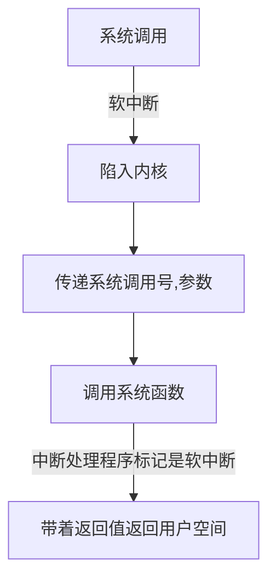

## 系统调用

**系统调用的基本流程**



系统调用是用户态访问内核态的一种常见方法.

> 1.  <font color=#b20>**系统为让用户能访问内核, 设置了很多的接口, 用户需要调用函数, 函数在连接固定的接口进入内核, 此时内核的函数执行就代替了用户在内核空间执行</font>**
> 2. **用户的函数调用实际上是产生了一个软中断信号, 促使从用户态进入内核态**
> 3. **软中断的接口一般是 %eax = 0x80 调用 sys_call() 函数陷入内核.**
> 4. <font color=#b20>**同时会调用 capable 检测是否对内核资源有权限进行操作**</font>


这里是一个关于write函数的一个内核实现代, 之所以没有printf, 主要它在内核的实现也是调用write的.

可以看到, 这里的write 函数有一行是

> <font color=#b20>**int $0x80, 这里就是调用 0x80接口的中断(int 是汇编里面的中断, 不是整形)**</font>
>
>  =a 是指汇编的返回值是存放在eax里面的. 
>
> "0" : 是指输入的第0个参数, 就是像数组一样, 从第11行 :"0" 的后面可以翻译成, a[0] = name, a[1] = b, a[2] = c, a[3] = d ... 
>
> 其他的也就可以不用详写了, 能明白就行了

```asm
_syscall3(int,write,int,fd,const char *,buf,off_t,count)

unistd.h

#define _syscall3(type,name,atype,a,btype,b,ctype,c) \
type name(atype a,btype b,ctype c) \
{ \
long __res; \
__asm__ volatile ("int $0x80" \
    : "=a" (__res) \
    : "0" (__NR_##name),"b" ((long)(a)),"c" ((long)(b)),"d" ((long)(c))); \
if (__res>=0) \
    return (type) __res; \
errno=-__res; \
return -1; \
}
```

**现在x86处理器使用的是sysenter, 比int中断指令更快地进入内核.**